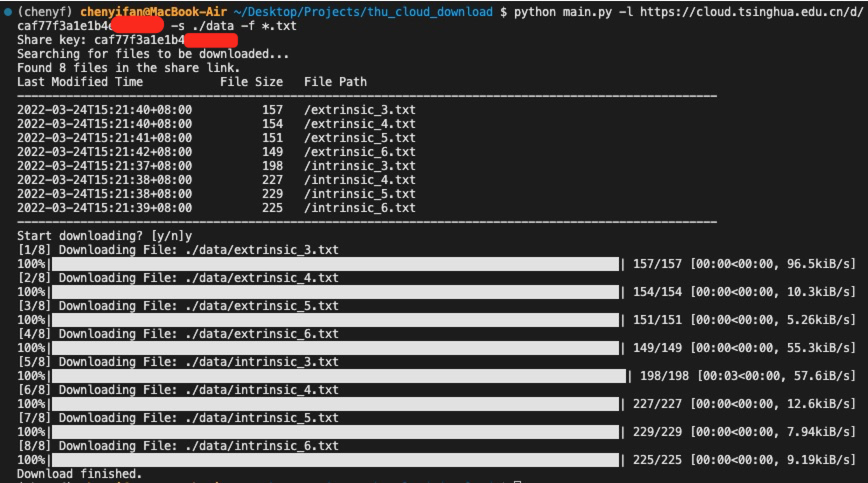

# Tsinghua Cloud Downloader
根据清华云盘的分享链接批量下载文件。

## Updates
- **2022.11.12** 更新了一些功能
    - 支持对含密码文件夹的下载（--password / -p参数）
<br/>
- **2022.10.28** 首次更新
    - 支持文件夹递归下载
    - 支持任意大小文件下载、
    - 支持指定文件后缀下载。（--file / -f参数）


## Dependency
    pip install tqdm

## Usage
- Show optional arguments
```
    python main.py -h
```

## Output Log Example
下载链接中的全部txt文件
